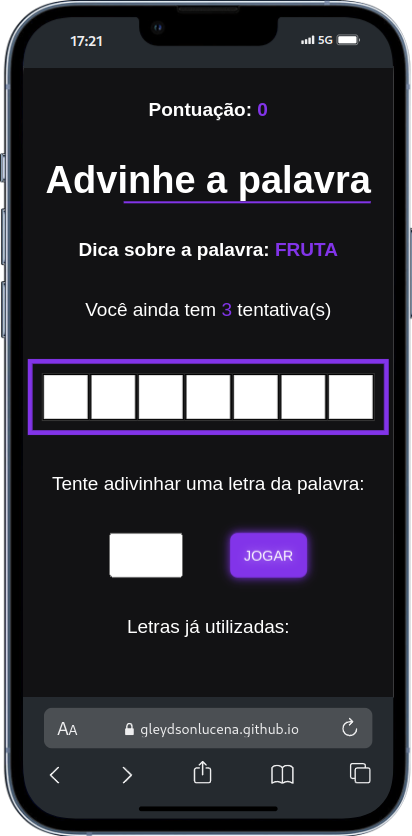
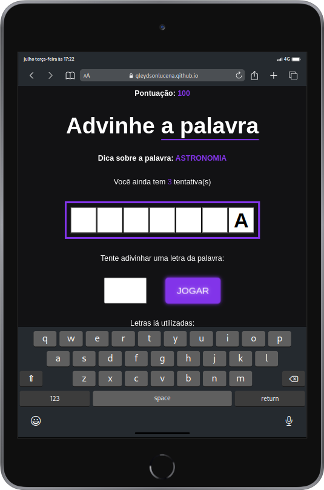
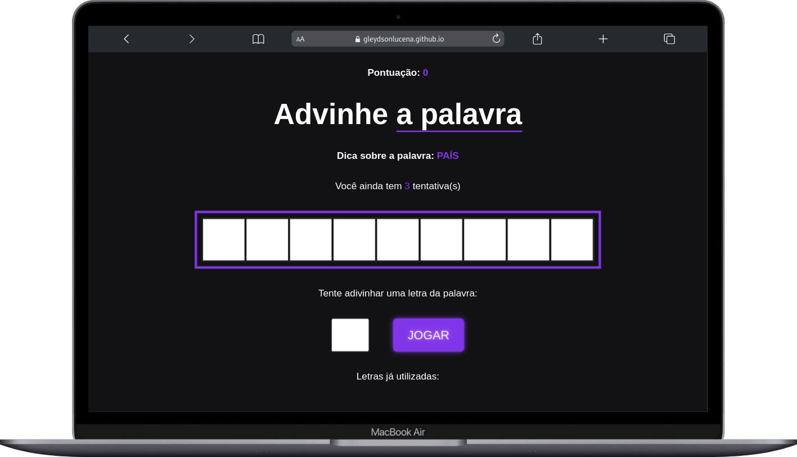

# Secret Word

 

Bem vindo ao jogo Secret Word

O Secret Word é um projeto aplicado no curso React do zero a maestria do grande professor <a href="https://github.com/matheusbattisti/"  target="_blank"> Matheus Batisti</a> encontrado na plataforma <a href="https://horadecodar.com.br/"  target="_blank"> Hora de codar</a>.

Deploy: <a href="https://gleydsonlucena.github.io/secret_word/"  target="_blank"> Jogar agora</a>

## Descriçao do projeto

 

O jogo tem como objetivo o jogador descobrir a palavra, para isso deve palpitar letras, até descobrir e completar a palavra, contendo 3 tentativas, e um score(pontuação), cada letra descoberta, é somado +100 pontos no score.

  
  
  

